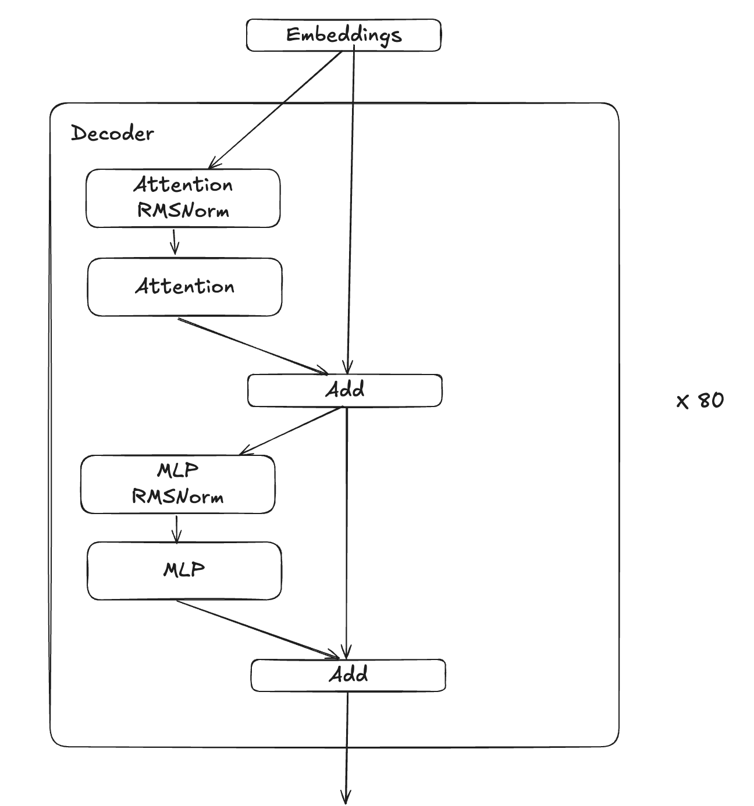

# LLMs in TT-NN
Authors:
## Contents
- [LLMs in TT-NN](#llms-in-tt-nn)
  - [Contents](#contents)
  - [1. Overview](#1-overview)
  - [2. Modules](#2-modules)
    - [2.1 Embedding](#21-embedding)
    - [2.2 RoPE](#22-rope)
    - [2.3 Norm](#23-norm)
    - [2.4 Attention](#24-attention)
    - [2.5 MLP](#25-mlp)
    - [2.6 Decoder](#26-decoder)
    - [2.7 LM Head](#27-lm-head)
  - [3. Features](#3-features)
    - [3.1 Generative Decoding](#31-generative-decoding)
    - [3.2 Prefill and Decode](#32-prefill-and-decode)
    - [3.3 Multi-Device](#33-multi-device)
    - [3.4 Continuous Batching](#34-continuous-batching)
    - [3.5 vLLM Integration](#34-vllm-integration)
  - [4. Best Practices and Optimizations](#4-best-practices-and-optimizations)
    - [4.1 Tracing](#41-tracing)
    - [4.2 Async Mode](#42-async-mode)
    - [4.3 Multiple CQs](#43-multiple-cqs)
    - [4.4 Op Configs](#44-op-configs)
    - [4.5 Accuracy](#45-accuracy)
    - [4.6 Performance Analysis](#46-performance-analysis)
    - [4.7 Misc. Performance Optimizations](#47-misc-performance-optimizations)
    - [4.8 Module Tests](#48-module-tests)
    - [4.9 Performance Testing](#49-performance-testing)
    - [4.10 Common Pitfalls](#410-common-pitfalls)
      - [4.10.1 Error Messages](#4101-error-messages)
      - [4.10.2 Shard Spec Mismatches](#4102-shard-spec-mismatches)
      - [4.10.3 Ethernet Dispatch Cores](#4103-ethernet-dispatch-cores)
      - [4.10.4 Hangs](#4104-hangs)
        - [4.10.4.1 Tracing](#41041-tracing)
        - [4.10.4.2 Large Matmuls](#41042-large-matmuls)

## 1. Overview
## 2. Modules
### 2.1 Embedding
### 2.2 RoPE
  - Iterative update system
  - When to use our fused op
### 2.3 Norm
  - Replicated layernorm vs distributed layernorm
    - Layernorm/rmsnorm weights in row major / wrapped around tile size trick
### 2.4 Attention
  - Flash Attention and Flash Decode
    - general description
    - limitations
    - which dims are parallelized
### 2.5 MLP
### 2.6 Decoder
<div align="center">

<figcaption>Llama3.1 Decoder</figcaption>
</div> <br>
If the components explained in previous sections (MLP, Attention, RMSNorm) are implemented, bringing up the decoder should be relatively straightforward. According to the diagram (based on the Llama3.1 example), the components are stacked sequentially during the forward pass. Only thing to worry about is whether addition of MLP and Attention outputs should be stored in L1 or in DRAM. <br><br> Decode forward pass implementation below follows diagram above and has nothing that is not already explained in previous sections. Also, it's crucial to deallocate tensors after their usage to optimize memory. However, in this explanation, tensor deallocation has been omitted for clarity and to keep the code as straightforward as possible.
<br><br><br>

```py
def forward(
        self,
        x: ttnn.Tensor,
        current_pos,
        rot_mat=None,
        transformation_mats=None,
        user_id=0,
        mode="decode",
        page_table=None,
    ) -> ttnn.Tensor:
        if mode == "prefill":
            skip_mem_cfg = ttnn.DRAM_MEMORY_CONFIG
        elif mode == 'decode':
            skip_mem_cfg = self.model_config["DEC_SKIP_OUTPUT_MEMCFG"]
        # Attention RMSNorm
        attn_norm = self.attention_norm(x)
        # Attention
        r = self.attention.forward(
            attn_norm,
            current_pos,
            rot_mat,
            transformation_mats,
            user_id,
            mode,
            page_table,
        )
        # Residual add of inputs and attention output
        h = ttnn.add(x, r, memory_config=skip_mem_cfg)
        # MLP and RMSNorm
        r = self.feed_forward.forward(self.ffn_norm(h), mode)
        # Residual add of attention output and mlp output
        out = ttnn.add(h, r, memory_config=skip_mem_cfg)

        return out
```

### 2.7 LM Head


## 3. Features
### 3.1 Generative Decoding
### 3.2 Prefill and Decode
  - submodules, tests
  - how to combine prefill and decode,
  - slicing prefill to fit in L1
### 3.3 Multi-Device
  - device mesh
  - column parallel followed by row parallel
  - sharding, CCL ops, reducing CCL overheads, etc.
### 3.4 Continuous Batching
  - quick intro and how it is implemented in demos.
### 3.5 vLLM Integration
  - Our vLLM repo and what's needed to integrate with it.
## 4. Best Practices and Optimizations
### 4.1 Tracing
  - link to existing doc, why it helps decode more
### 4.2 Async Mode
### 4.3 Multiple CQs
  - how to feed back output to input and read output asyncronously
### 4.4 Op Configs
  - Writing correct program configs and shard specs
  - Deciding how many cores to run an op on
    - Why did we use 16 cores for MLP
  - Which matmul to use when @Colman Glagovich
    - 1d, 2d, dram-sharded, ...
  - Implicitly padding weights in program config for matmuls
### 4.5 Accuracy
  - How we measure it (PCC, perplexity, top-1/top-5, end-user tests, benchmarking)
  - How much PCC is enough? Rules of thumb.
  - Accuracy tests
  - Debugging PCC issues
### 4.6 Performance Analysis
  - Performance tooling, tracy
### 4.7 Misc. Performance Optimizations
  - Which dim to shard matmuls on
  - DRAM-sharding
  - Avoiding sharded to interleaved calls
### 4.8 Module Tests
### 4.9 Performance Testing
### 4.10 Common Pitfalls
#### 4.10.1 Error Messages
  - Running out of L1
  - Shard spec and program config mismatches
  - For some TTNN ops (e.g. ttnn.all_gather) it's not supported to pass -1 in the dim argument.
    - You'll see an error related to op invocation where the arguments don't match
#### 4.10.2 Shard Spec Mismatches
#### 4.10.3 Ethernet Dispatch Cores
  - link to any other description, and mention it is needed for N300 and T3K
#### 4.10.4 Hangs
##### 4.10.4.1 Tracing
  - Host communications cause tracing to hang
  - Running without async mode enabled causes tracing to hang
  - Careful with print in tracing
##### 4.10.4.2 Large Matmuls
  - Large matmuls hanging? Link to appropriate ticket with workaround
  - Issue is being investigated with a workaround of setting the output subblock to 1,1 and grid size to 8x7
