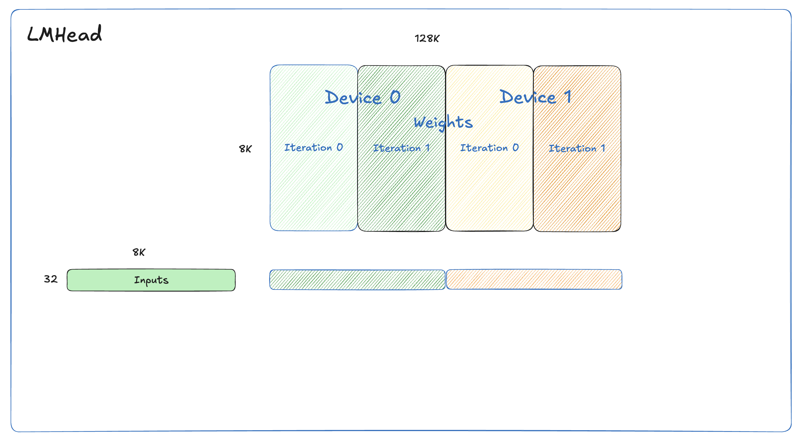
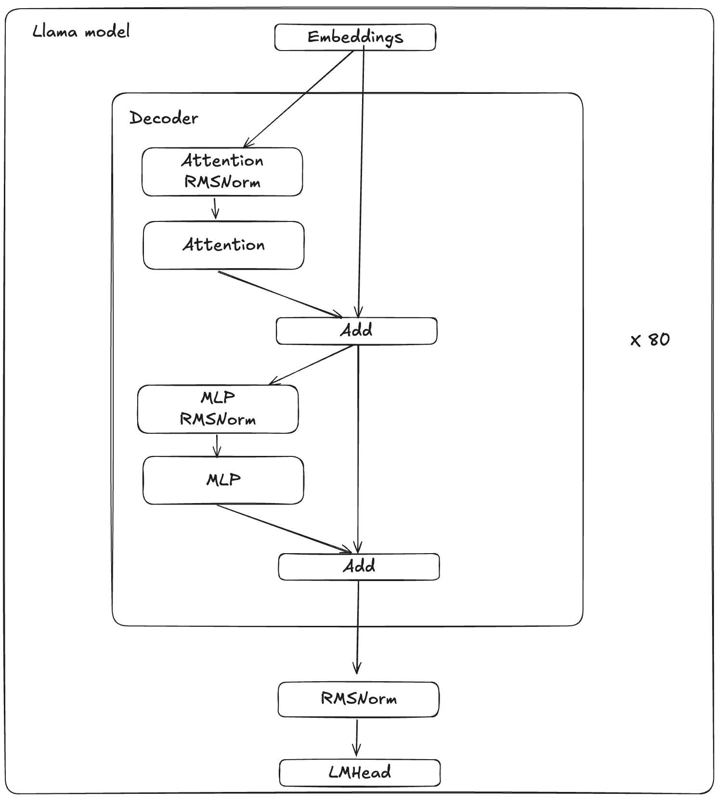

# LLMs in TT-NN
Authors:
## Contents
- [LLMs in TT-NN](#llms-in-tt-nn)
  - [Contents](#contents)
  - [1. Overview](#1-overview)
  - [2. Modules](#2-modules)
    - [2.1 Embedding](#21-embedding)
    - [2.2 RoPE](#22-rope)
    - [2.3 Norm](#23-norm)
    - [2.4 Attention](#24-attention)
    - [2.5 MLP](#25-mlp)
    - [2.6 Decoder](#26-decoder)
    - [2.7 LM Head](#27-lm-head)
  - [3. Features](#3-features)
    - [3.1 Generative Decoding](#31-generative-decoding)
    - [3.2 Prefill and Decode](#32-prefill-and-decode)
    - [3.3 Multi-Device](#33-multi-device)
    - [3.4 Continuous Batching](#34-continuous-batching)
    - [3.5 vLLM Integration](#34-vllm-integration)
  - [4. Best Practices and Optimizations](#4-best-practices-and-optimizations)
    - [4.1 Tracing](#41-tracing)
    - [4.2 Async Mode](#42-async-mode)
    - [4.3 Multiple CQs](#43-multiple-cqs)
    - [4.4 Op Configs](#44-op-configs)
    - [4.5 Accuracy](#45-accuracy)
    - [4.6 Performance Analysis](#46-performance-analysis)
    - [4.7 Misc. Performance Optimizations](#47-misc-performance-optimizations)
    - [4.8 Module Tests](#48-module-tests)
    - [4.9 Performance Testing](#49-performance-testing)
    - [4.10 Common Pitfalls](#410-common-pitfalls)
      - [4.10.1 Error Messages](#4101-error-messages)
      - [4.10.2 Shard Spec Mismatches](#4102-shard-spec-mismatches)
      - [4.10.3 Ethernet Dispatch Cores](#4103-ethernet-dispatch-cores)
      - [4.10.4 Hangs](#4104-hangs)
        - [4.10.4.1 Tracing](#41041-tracing)
        - [4.10.4.2 Large Matmuls](#41042-large-matmuls)

## 1. Overview
## 2. Modules
### 2.1 Embedding
### 2.2 RoPE
  - Iterative update system
  - When to use our fused op
### 2.3 Norm
  - Replicated layernorm vs distributed layernorm
    - Layernorm/rmsnorm weights in row major / wrapped around tile size trick
### 2.4 Attention
  - Flash Attention and Flash Decode
    - general description
    - limitations
    - which dims are parallelized
### 2.5 MLP
### 2.6 Decoder
<div align="center">

</div> <br>
If the components explained in previous sections (MLP, Attention, RMSNorm) are implemented, bringing up the decoder should be relatively straightforward. According to the diagram (based on the Llama3.1 example), the components are stacked sequentially during the forward pass. Only thing to worry about is whether addition of MLP and Attention outputs should be stored in L1 or in DRAM. <br><br> Decode forward pass implementation below follows diagram above and has nothing that is not already explained in previous sections. Also, it's crucial to deallocate tensors after their usage to optimize memory. Keep in mind to always deallocate tensors as shown in the example below.

<br>

To optimize performance in decode mode, we maintain the residual stream in L1 and shard it across cores and devices. However, determining the optimal number of cores for sharding can be challenging, especially for operations like DRAM-sharded matmuls. Here is the [link](https://github.com/tenstorrent/tt-metal/blob/53c32c0c0da926f97bd0eb042e70fd54c2866f44/models/demos/llama3/tt/model_config.py#L931) to the code which produces core grid that will divide the N and K dims of a matmul evenly. When it’s not feasible to keep the streams sharded, we use interleave_to_sharded, and conversely, switch back as needed. In our implementation of Llama3.1 there are some ops that require interleaved tensors and resharding. 
<br><br>

```py
def forward(
        self,
        x: ttnn.Tensor,
        current_pos,
        rot_mat=None,
        transformation_mats=None,
        user_id=0,
        mode="decode",
        page_table=None,
    ) -> ttnn.Tensor:
        if mode == "prefill":
            skip_mem_cfg = ttnn.DRAM_MEMORY_CONFIG
        elif mode == 'decode':
            skip_mem_cfg = self.model_config["DEC_SKIP_OUTPUT_MEMCFG"]
        # Attention RMSNorm
        attn_in = self.attention_norm(x)
        # Attention
        attn_out = self.attention.forward(
            attn_in,
            current_pos,
            rot_mat,
            transformation_mats,
            user_id,
            mode,
            page_table,
        )
        ttnn.deallocate(attn_in)
        # Residual add of inputs and attention output
        h = ttnn.add(x, attn_out, memory_config=skip_mem_cfg)
        ttnn.deallocate(attn_out)
        # MLP and RMSNorm
        ff_out = self.feed_forward.forward(self.ffn_norm(h), mode)
        # Residual add of attention output and mlp output
        out = ttnn.add(h, ff_out, memory_config=skip_mem_cfg)
        
        ttnn.deallocate(ff_out)
        ttnn.deallocate(h)

        return out
```


### 2.7 LM Head
The LMHead is unique because LLMs typically have large ```vocab_size```, which is independent of the model size (e.g., 1B, 2B, 8B, 405B parameters). As a result, the LMHead always has a large last_dim in its weight matrix. Given the substantial size of LMHead weights and the memory limitations of hardware, these weights must be distributed across multiple devices and processed in iterations, while activations are replicated across devices.

The number of iterations required depends on the size of the weights and the number of devices available, which can range from 1 to several iterations. For example, in Llama 3.1’s decode mode, the LMHead matrix multiplication involves shapes ```(32, 8K) x (8K, 128K)```.

Below is an illustration of how the LMHead weights are partitioned across two devices, followed by its implementation. For educational purposes it's used 128K for vocab_size even though it's 128256 for Llama3.1

<div align="center">

</div> <br>

```py
size_per_device = self.vocab_size // self.num_devices
num_splits = math.ceil(size_per_device / max_columns_per_device)

split_sizes = [min(size_per_device, max_columns_per_device)] * (num_splits - 1)
split_sizes.append(size_per_device - sum(split_sizes))  # remaining columns

# Split the output weights
torch_output_weights = state_dict[f"{state_dict_prefix}output.weight"].permute(1, 0)

self.output_weights = []

for i, split_size in enumerate(split_sizes):
    cache_file_name = (
        None if args.dummy_weights else weight_cache_path / f"output_lm_head_{num_splits}_split_shard_{i}"
    )

    # Create a list to store the split tensors for each device
    device_splits = []
    for device in range(self.num_devices):
        start = device * size_per_device + sum(split_sizes[:i])
        end = start + split_size
        device_splits.append(torch_output_weights[:, start:end])

    # Concatenate the splits from all devices
    combined_split = torch.cat(device_splits, dim=-1)

    memory_config = args.create_dram_sharded_mem_config(
        k=args.dim, n=combined_split.shape[-1] // self.num_devices
    )
    self.output_weights.append(
        ttnn.as_tensor(
            combined_split,
            device=mesh_device,
            mesh_mapper=ttnn.ShardTensorToMesh(mesh_device, dim=-1),
            layout=ttnn.TILE_LAYOUT,
            dtype=dtype,
            memory_config=memory_config,
            cache_file_name=cache_file_name,
        )
    )
```
We use dram-sharded matmul for LMHead with ```program_config``` and ```memory_config``` generated in code below. If you want to learn why we decided to use them check out [Section: Op Configs](#4-4-op-configs). The primary reason for having multiple program_configs is that the weight shapes may result in unequal split sizes. This variability means the same configuration cannot be used for every matrix multiplication.
```py
# Generate dram-sharded memory_config
memory_config = args.create_dram_sharded_mem_config(
    k=args.dim, n=combined_split.shape[-1] // self.num_devices
)
# Generate dram-sharded program_config
self.program_configs = [
    args.dram_matmul_config(
        args.tile_padded_batch_rows,
        args.dim,
        split_size,
        args.lm_head_core_grid.num_cores,
    )
    for split_size in split_sizes
]
```
Once weights are pushed to devices and decoders are executed LMHead forward pass needs to be executed in iterations. Code below shows that after each iteration outputs are converted from sharded to interleaved tensors. Once all iterations are completed final output is produced by concatenation over last dim and returned as output.

When executing the model, it is essential to ensure that the output of the last decoder is already replicated across tensors. Since this replication is enforced earlier, no additional code is required in the LMHead forward pass to handle it.

The LMHead forward pass is executed iteratively. The code below illustrates how, after each iteration, the outputs are converted from sharded tensors to interleaved tensors. After all iterations are completed, the tensors are concatenated along the last dimension to produce the final output, which is then returned.

```py
def forward(self, x: ttnn.Tensor):
    outputs = []
    for weight, pc in zip(self.output_weights, self.program_configs):
        output = ttnn.linear(
            x,
            weight,
            compute_kernel_config=self.compute_kernel_config,
            program_config=pc,
            memory_config=ttnn.L1_WIDTH_SHARDED_MEMORY_CONFIG,
            dtype=ttnn.bfloat8_b,
        )
        outputs.append(output)

    # Concatenate the outputs
    output = ttnn.concat(outputs, dim=-1, memory_config=ttnn.DRAM_MEMORY_CONFIG)

    return output
```
### 2.8 Model

<div align="center">

</div> <br>

Once the model components are implemented, there isn’t much left to finalize. In our implementation, embeddings are managed outside the model class, as explained in an earlier section, so they are not included within the model class itself.

The model’s constructor initializes N decoders (80 for Llama3.1-70b), an RMSNorm object, and the LMHead, ensuring that weights for all components are loaded onto the appropriate devices.

During the forward pass, the decoders are executed sequentially, followed by normalization and the LMHead computation at the end. A specific optimization is applied for the prefill mode: since only the last token is relevant, the LMHead is executed only on the final tile in this mode.

In prefill mode, the RMSNorm output is interleaved, but the LMHead requires a sharded tensor. To accommodate this, the ```interleaved_to_sharded``` function is used to prepare the output accordingly.

```py
def forward(
    self,
    x: ttnn.Tensor,
    current_pos,
    rot_mat=None,
    transformation_mats=None,
    user_id=0,
    mode="decode",
    page_table=None,
    get_last_token=-1,
):
    for layer in self.layers:
        x = layer(x, current_pos, rot_mat, transformation_mats, user_id, mode, page_table)

    if mode == "prefill" and get_last_token == -1:
        return x

    # Slicing the tensor to the nearest ceiling/floor multiples of 32 for the prefill_len, to get the last token
    if get_last_token != -1:
        x = ttnn.slice(x, (0, 0, get_last_token, 0), (1, 1, get_last_token + 32, x.shape[-1]))

    # Output norm
    x = self.norm(x, mode=mode)

    if mode == "prefill":
        x = ttnn.interleaved_to_sharded(
            x,
            self.model_config["LM_HEAD_INPUT_MEMCFG"],
        )

    return self.lm_head(x)
```


## 3. Features
### 3.1 Generative Decoding
### 3.2 Prefill and Decode
  - submodules, tests
  - how to combine prefill and decode,
  - slicing prefill to fit in L1
### 3.3 Multi-Device
  - device mesh
  - column parallel followed by row parallel
  - sharding, CCL ops, reducing CCL overheads, etc.
### 3.4 Continuous Batching
  - quick intro and how it is implemented in demos.
### 3.5 vLLM Integration
  - Our vLLM repo and what's needed to integrate with it.
## 4. Best Practices and Optimizations
### 4.1 Tracing
  - link to existing doc, why it helps decode more
### 4.2 Async Mode
### 4.3 Multiple CQs
  - how to feed back output to input and read output asyncronously
### 4.4 Op Configs
  - Writing correct program configs and shard specs
  - Deciding how many cores to run an op on
    - Why did we use 16 cores for MLP
  - Which matmul to use when @Colman Glagovich
    - 1d, 2d, dram-sharded, ...
  - Implicitly padding weights in program config for matmuls
### 4.5 Accuracy
  - How we measure it (PCC, perplexity, top-1/top-5, end-user tests, benchmarking)
  - How much PCC is enough? Rules of thumb.
  - Accuracy tests
  - Debugging PCC issues
### 4.6 Performance Analysis
  - Performance tooling, tracy
### 4.7 Misc. Performance Optimizations
  - Which dim to shard matmuls on
  - DRAM-sharding
  - Avoiding sharded to interleaved calls
### 4.8 Module Tests
### 4.9 Performance Testing
### 4.10 Common Pitfalls
#### 4.10.1 Error Messages
  - Running out of L1
  - Shard spec and program config mismatches
  - For some TTNN ops (e.g. ttnn.all_gather) it's not supported to pass -1 in the dim argument.
    - You'll see an error related to op invocation where the arguments don't match
#### 4.10.2 Shard Spec Mismatches
#### 4.10.3 Ethernet Dispatch Cores
  - link to any other description, and mention it is needed for N300 and T3K
#### 4.10.4 Hangs
##### 4.10.4.1 Tracing
  - Host communications cause tracing to hang
  - Running without async mode enabled causes tracing to hang
  - Careful with print in tracing
##### 4.10.4.2 Large Matmuls
  - Large matmuls hanging? Link to appropriate ticket with workaround
  - Issue is being investigated with a workaround of setting the output subblock to 1,1 and grid size to 8x7
